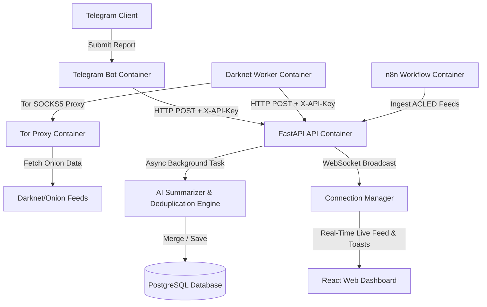

# Osinit (v2.0.0-beta)

> Osinit is a self-hosted, standalone open-source intelligence (OSINT) aggregator designed for real-time armed conflict monitoring. It gathers structured incident reports from local users via Telegram, encrypted darknet forums via a Tor proxy, and external APIs (e.g. ACLED), performing AI summarization, topic deduplication/merging, and broadcasting updates in real time to a web dashboard via WebSockets.

[](#getting-started)
[](#key-features--benefits)
[](https://opensource.org/licenses/MIT)

---

## The Problem

Monitoring active conflict zones requires aggregating information from disparate, fragmented, and highly volatile sources.
Manual collection from Telegram chats, security channels, and underground onion sites is time-consuming, repetitive (due to duplicate reporting), and dangerous.
Analysts lack a unified workspace to view clearnet and darknet feeds side-by-side with real-time updates and automated summarization.

---

## The Solution: Osinit

Osinit addresses these issues by providing a fully localized, containerized system for conflict intelligence aggregation.
It enables anonymous ingestion from Tor onion sites using a secure local proxy alongside user-submitted Telegram reports.
All incoming reports undergo **AI Summarization** & **Topic-based Deduplication Merging** (combining reports on the same event into unified Master Incidents), and are streamed live to analysts via **WebSockets**.

---

## Key Features & Benefits (Beta Version)

| Feature | Developer & Analyst Benefit |
| :--- | :--- |
| **Real-Time WebSockets & Toast UX** | Streams live events (`INCIDENT_CREATED`, `INCIDENT_UPDATED`) to the React dashboard with instant Toast notifications. |
| **AI Summarization & Severity Rating** | Automatically generates concise summaries, assigns severity levels (`Critical`, `High`, `Medium`, `Low`), and extracts tags. |
| **Multi-Source Deduplication & Merging** | Identifies overlapping reports on the same event and merges them into a single Master Incident with combined source references. |
| **Ingestion API Security (`X-API-Key`)** | Protects ingestion endpoints against unauthorized posts and spam using header-based API Key authentication. |
| **Analyst Data Export (CSV & JSON)** | Allows analysts to export curated, filtered intelligence feeds directly to CSV spreadsheet or JSON formats. |
| **System Health Monitoring** | Dedicated `/api/v1/health` endpoint and container health checks for air-gapped monitoring. |
| **Secure Tor Routing** | Routes all darknet scrapers through a local SOCKS5 Tor proxy to ensure complete network anonymity. |
| **Docker-First Architecture** | Simplifies deployment to a single command running all dependencies locally in isolated containers. |

---

## How It Works

### System Architecture



### Ingestion & Processing Flow
1. **Authenticated Ingestion**: Reports are submitted via `POST /api/v1/incidents` using `X-API-Key` authentication.
2. **Instant Async Response**: The API persists the raw report and responds with `202 Accepted` immediately.
3. **AI Pipeline**: Background workers generate concise summaries, rate severity, and compare topic similarity with recent active incidents.
4. **Topic Merging**: If an incident covers an existing event, it is merged into the Master Incident (appending source links and updating summary).
5. **Real-Time Stream**: The WebSocket server broadcasts updates to connected browsers, triggering live Toast alerts and updating the dashboard feed.

---

## Getting Started

### Prerequisites
- Docker and Docker Compose installed on your host machine.
- A Telegram Bot Token (obtained from [@BotFather](https://t.me/BotFather)).

### Setup Instructions

1. **Clone the Repository**
   ```bash
   git clone https://github.com/chris/Osinit.git
   cd Osinit
   ```

2. **Configure Environment Variables**
   Create a `.env` file in the root directory (or edit the existing one):
   ```env
   TELEGRAM_BOT_TOKEN=your_telegram_bot_token_here
   INGESTION_API_KEY=osinit-beta-secret-key
   ```

3. **Build and Run with Docker Compose**
   Launch the system services in the background:
   ```bash
   docker compose up --build -d
   ```

4. **Access Local Services**
   - **React Dashboard**: `http://localhost:3000` (Live WebSockets feed & Toast alerts)
   - **FastAPI Documentation & Swagger**: `http://localhost:8001/docs`
   - **System Health Check**: `http://localhost:8001/api/v1/health`
   - **n8n Automation Console**: `http://localhost:5678`

---

## Security & Trust Signals

- **Offline-First & Air-Gapped**: Fully functional in local or air-gapped environments without telemetry.
- **Auditable Security**: Built using standard container patterns with fully auditable Python and TypeScript codebases.
- **MIT Licensed**: Free software licensed under the MIT License; modify and run privately as needed.

